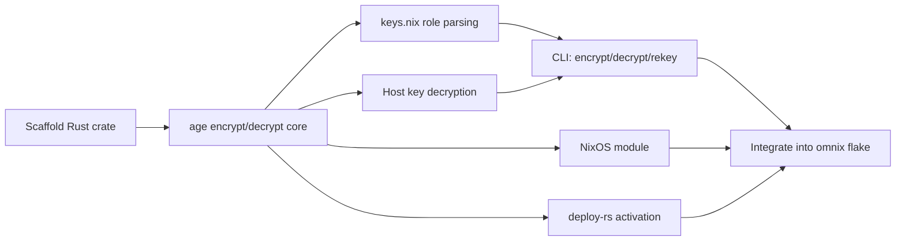

# Roadmap

PR review findings (all fixed)

- [x] nixosModules.default should include upstream disko and ragenix modules
- [x] packages.disko: replace silent null fallback with explicit error
- [x] modules/services.nix: replace nested conditionals with lib.optionalAttrs
- [x] modules/services.nix: create fallback group when cfg.group is null
- [x] modules/base.nix: remove stateVersion default, require explicit setting
- [x] modules/digitalocean.nix: add comment about unconditional imports
- [x] modules/disko.nix: guard for upstream disko module presence
- [x] lib/shell.nix: add cleanup trap in resolveIp
- [x] README.md: clarify nixosModules.default includes upstream modules
- [x] templates CI: fix branch gate, use pinned host key instead of ssh-keyscan
- [x] templates flake.nix: add deploy target comment, simplify module imports
- [x] templates variables.tf: add input validation
- [x] templates terraform.tfvars.example: document encryption workflow
- [x] templates os.nix: remove unused pkgs argument
- [x] templates services.nix: use neutral dataDir default

## Refactor to idiomatic Nix

The initial extraction from moneymentum was mechanical copy-paste. This pass
makes it proper library-quality Nix before more consumers adopt.

- [x] Consolidate duplicate `resolveIp` / `parseIdentity` shell fragments --
      extracted to lib/shell.nix, removed redundant lib/remote.nix
- [ ] Organize lib/ more logically -- group related helpers, review module
      boundaries
- [ ] Use NixOS module options consistently -- current lib functions use raw
      attrset args, some could be module options instead for better composition
      and type checking
- [ ] Add `_module.args` passthrough for omnix-specific config so consumers
      don't need to wire specialArgs manually
- [ ] Break down flake.nix -- separate concerns into importable files (outputs,
      package definitions) so the main flake.nix stays small and scannable

## Age-based secret management

Build a Rust CLI using the `age` crate that handles the secret lifecycle omnix
consumers need: encrypt secrets to role-based recipients defined in `keys.nix`,
decrypt on-host using the SSH host key, and integrate with deploy-rs activation.
This replaces the ragenix dependency with an omnix-owned tool.

The current pattern in existing deployments: `.toml.age` files committed to git,
deploy-rs activation calls `rage` to decrypt to `/run/agenix/` using the host's
`/etc/ssh/ssh_host_ed25519_key`, services read plaintext from tmpfs. The new
tool must support this exact workflow.

- [ ] Scaffold `crates/omnix-age/` Rust crate with `age` dependency
- [ ] Implement encrypt/decrypt using age -- encrypt to multiple recipients,
      decrypt with SSH identity file
- [ ] Support `keys.nix` role-based recipient resolution -- parse the Nix
      attrset to extract public keys per role
- [ ] Support on-host decryption using SSH host key --
      `/etc/ssh/ssh_host_ed25519_key` as identity, same as ragenix today
- [ ] CLI: `omnix-age encrypt`, `omnix-age decrypt`, `omnix-age rekey`
- [ ] Integrate into omnix flake as a package
- [ ] Add NixOS module to omnix -- declares secrets with encryption rules,
      replaces ragenix module import
- [ ] Add deploy-rs activation that uses omnix-age instead of raw rage commands
- [ ] Optional: implement secretspec `Provider` trait to emit `secretspec.toml`
      -- if the secretspec SDK is available, wire the `Provider` trait so the
      CLI can produce structured secret declarations alongside age encryption

## CI generation

A lib function that generates GitHub Actions workflow YAML from Nix config,
keeping CI in sync with the build system -- when packages change, CI updates
automatically.

- [ ] Design CI generation API -- take a list of checks/builds and produce
      `.github/workflows/ci.yml` content
- [ ] Support common patterns: parallel jobs, nix cache, deploy-on-push,
      submodule caching, SSH key setup
- [ ] Generate deploy job that uses omnix deploy wrappers
- [ ] Support matrix strategies for multi-target builds

## Integration test flow

Validate the full omnix lifecycle end-to-end: provision infrastructure via
terraform, bootstrap with nixos-anywhere, deploy sample services, verify access
via remote, then tear everything down. Runs on GitHub Actions (ubuntu-latest)
since the NixOS closure can't build on macOS without remote-build.

Manual-only trigger via `workflow_dispatch` to control cloud spend (~$0.01-0.05
per run, a few minutes of a $12/mo droplet).

- [x] GitHub Actions workflow for full lifecycle (manual trigger)
- [x] Scaffold test project from template, provision, bootstrap, deploy, verify
- [x] Teardown via terraform destroy (always runs, even on failure)
- [ ] Add service-level verification -- deploy a sample service, hit its HTTP
      endpoint, verify response
- [ ] Redeploy test -- deploy a different service profile, verify switchover
- [ ] `mkIntegrationTest` lib function -- let consumers define their own
      lifecycle test flows using the same harness, parameterized by their
      project-specific config (services, keys, node name)

## Not epic

- [ ] Add Hetzner cloud modules -- alternative to DigitalOcean for when we need
      better price/performance or EU hosting
- [x] Add ACME/Let's Encrypt module -- modules/acme.nix with typed options
- [x] Add logrotate module -- integrated into modules/services.nix per-service

## Completed: Extract and publish omnix

Extracted from moneymentum, published as standalone library at
`data-cartel/omnix`. Moneymentum migrated as first consumer.

- [x] Extract omnix from moneymentum into standalone flake
- [x] Move omnix to its own repo (`data-cartel/omnix`)
- [x] Wire moneymentum as first consumer
- [x] All 7 NixOS modules implemented with typed option interfaces
- [x] All 4 lib functions (mkTerraform, mkDeploy, mkBootstrap, mkGitHooks)
      implemented
- [x] Flake template (`do-service`) scaffolds complete projects
