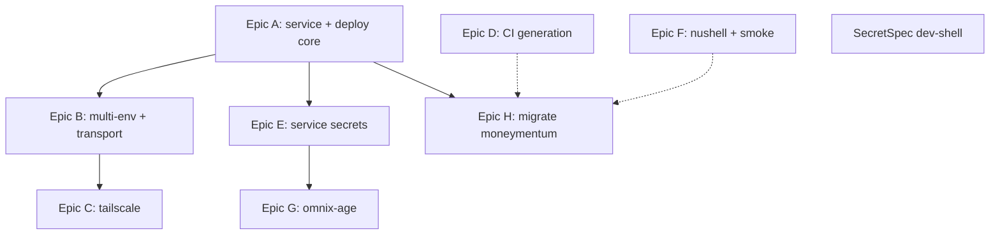

# Roadmap

omnix is becoming the shared library that the data-cartel / st0x repos consume.
The consolidation lifts every genuinely-generic capability out of the consumer
repos (`st0x.liquidity`, `st0x.rest.api`, `moneymentum`) into omnix as
composable modules, lib functions, and opt-in building blocks, so each consumer
shrinks to data + policy (`keys.nix`, a services data file, an `os.nix` enabling
modules, `infra/` terraform) while omnix owns the mechanism.

See [SPEC.md](./SPEC.md) for the vision and
[adrs/0001-opt-in-ci-and-dev-tooling.md](./adrs/0001-opt-in-ci-and-dev-tooling.md)
for the rule that authorizes shipping CI and dev tooling here.

## Dependency graph

Epic D, Epic F, and the SecretSpec dev-shell are independent — they land in
parallel with the A→B→C and A→E→G chains. Each epic is one stacked branch / one
draft PR.

## Epic A: Service model + deploy activation core (#13)

Bring omnix's service/deploy layer up to the most-advanced consumer so every
repo can adopt it instead of maintaining bespoke copies. This is the keystone —
it unblocks Epics B, C, E, and H. Canonical source: `st0x.liquidity`
`deploy.nix` + `nix/upgradeable-services.nix`.

- [ ] `lib/services.nix` — `mkServices` (kind union service/oneshot/static +
      deterministic `order`), shared by module and deploy
- [ ] rewrite `modules/services.nix` to the kind union; fold `static-sites.nix`
      in as `kind=static` with a `mkRenamedOptionModule` shim
- [ ] in-activation `reset-failed` recovery; `secretsArg`/`configFromRun` knob
- [ ] rewrite `lib/deploy.nix` — `order` sort + duplicate-order throw; per-kind
      activation branch; opt-in `chownPaths`/`recordGitRev`/`resetState` hooks;
      `--boot` wrapper
- [ ] update template `services.nix`/flake + `eval-*` checks

## Epic D: CI generation + reusable workflows (#16)

One CI kernel, drift-checked and dogfooded, so CI stops re-diverging.
Independent of the infra chain. Authorized by ADR 0001.

- [ ] `lib/ci.nix` (`mkCI`) + `lib/ci-deploy.nix` (`mkDeployWorkflow`) emitting
      workflow YAML + a `check` derivation added to flake `checks`
- [ ] parameterized install/cache union (default determinate + magic-nix-cache)
- [ ] reusable `.github/workflows/{externally-merged,rekey,deploy,nix-setup}.yml`
- [ ] regenerate omnix's own + template workflows; canonicalize on `SSH_KEY`

## Epic F: Nushell + smoke/monitoring tooling (#18)

Share the generic version-control and verification tooling as opt-in flake
apps / lib. Independent of the infra chain. Authorized by ADR 0001.

- [ ] `lib/nu.nix` (`mkNuScript`, `scriptsDir` param, `.test.nu` in checkPhase)
- [ ] `scripts/{gitbutler-stack,pr-stack-footer,pr-template}.nu` + `.test.nu` +
      shared `_pr.nu`; exposed as flake packages/apps/checks
- [ ] `lib/smoke.nix` (`mkSmoke`) + `mkUptimeRobotMonitors`

## SecretSpec: dev-shell + manifest (#19)

Give developers a typed local-secrets workflow without changing the prod-path
secret model. age (via `omnix-age`, Epic G) stays the authoritative store; a
custom age-backed provider is infeasible (registry is crate-private).
Independent and small.

- [ ] `pkgs.secretspec` in omnix + template dev shells
- [ ] `templates/do-service/secretspec.toml` (default/development/production
      profiles)
- [ ] dev-only scope documented

## Epic B: Multi-environment + deploy transport (#14)

N-environment node/script generation and tailnet-vs-IP transport. Depends on
Epic A.

- [ ] `mkDeploy` `environments` attrset → N nodes + `${env}Deploy*` (single-env
      alias preserves the template's deploy script names)
- [ ] lift per-env terraform helpers + `resolveHost` (tailnet probe → MagicDNS,
      else cached IP) into `lib/shell.nix`
- [ ] `mkDeploy` `transport` param (ip | tailnet)

## Epic E: Service secrets (pure-Nix age bridge) (#17)

omnix owns on-host decrypt + validate-gate + rule derivation, closing the
`age.secrets` wiring gap and pinning the interface `omnix-age` will later back.
Depends on Epic A.

- [ ] `omnix.serviceSecrets` module (`modules/service-secrets.nix`)
- [ ] `mkDeploy` `serviceSecrets` arg (on-host decrypt + `validateCommand` gate)
- [ ] `lib/secret-rules.nix` (`mkServiceSecretRules`, polymorphic `recipients`
      for flat and `roles.{prod,staging}.service` shapes)
- [ ] `mkSecretApp` + `serviceRules` arg in `lib/terraform.nix`

## Epic C: Tailscale (#15)

Enrollment + HTTPS cert provisioning as a reusable module. Depends on Epic B
(deploy transport). Canonical source: `st0x.liquidity/nix/tailscale.nix`.

- [ ] `modules/tailscale.nix` (`omnix.tailscale.*`): enrollment, firewall
      pairing, stale-TUN `ExecStartPre` fix, cert oneshot/timer with
      parameterized consumer reload
- [ ] opt-in ragenix `authKeySecret`; `tls.*` with `readOnly` certFile/keyFile
      outputs
- [ ] register in nixosModules + `default.imports` (inert until enabled);
      `eval-tailscale` check; commented template opt-in stanza

## Epic G: omnix-age CLI (#20)

Replace the ragenix dependency with an omnix-owned `age` CLI behind Epic E's
interface (drop-in, no consumer change). Depends on Epic E.

- [ ] `crates/omnix-age` — encrypt/decrypt (age crate), `keys.nix` role
      parsing, on-host SSH-host-key decrypt, CLI (encrypt/decrypt/rekey)
- [ ] NixOS module + deploy-rs activation; swap the `rage -d` call in
      `serviceSecrets`
- [ ] optional: consume `secretspec.toml` as the declaration schema

## Epic H: Migrate moneymentum onto omnix (#21)

Prove the lifted abstractions are generic by making moneymentum a thin consumer.
Cross-repo work in the moneymentum repo. Depends on Epics A/D/F (+E if adopting
`serviceSecrets`).

- [ ] adopt `mkNuScript`; `kind` union + `order` + in-activation `reset-failed`;
      `mkCI`/`mkDeployWorkflow`; optionally `serviceSecrets`
- [ ] keep project-specific: `deployFrontend` rsync, bun caching, post-deploy
      smoke

## Integration test flow

Validate the full omnix lifecycle end-to-end: provision infrastructure via
terraform, bootstrap with nixos-anywhere, deploy sample services, verify access
via remote, then tear everything down. Runs on GitHub Actions (ubuntu-latest)
since the NixOS closure can't build on macOS without remote-build. Manual-only
trigger via `workflow_dispatch` to control cloud spend.

- [x] GitHub Actions workflow for full lifecycle (manual trigger)
- [x] Scaffold test project from template, provision, bootstrap, deploy, verify
- [x] Teardown via terraform destroy (always runs, even on failure)
- [ ] Add service-level verification -- deploy a sample service, hit its HTTP
      endpoint, verify response
- [ ] Redeploy test -- deploy a different service profile, verify switchover
- [ ] `mkIntegrationTest` lib function -- let consumers define their own
      lifecycle test flows using the same harness

## Not epic

- [ ] Organize lib/ more logically -- group related helpers, review module
      boundaries
- [ ] Use NixOS module options consistently -- some lib functions use raw
      attrset args that could be module options for better composition
- [ ] Add `_module.args` passthrough for omnix-specific config so consumers
      don't need to wire specialArgs manually
- [ ] Break down flake.nix -- separate concerns into importable files (outputs,
      package definitions) so the main flake.nix stays small and scannable
- [ ] Add Hetzner cloud modules -- alternative to DigitalOcean for EU hosting
      or better price/performance

## Completed: Extract and publish omnix

Extracted from moneymentum, published as standalone library at
`data-cartel/omnix`. Moneymentum migrated as first consumer.

- [x] Extract omnix from moneymentum into standalone flake
- [x] Move omnix to its own repo (`data-cartel/omnix`)
- [x] Wire moneymentum as first consumer
- [x] All 6 NixOS modules implemented with typed option interfaces
- [x] All 4 lib functions (mkTerraform, mkDeploy, mkBootstrap, mkGitHooks)
      implemented
- [x] Flake template (`do-service`) scaffolds complete projects
- [x] Consolidate duplicate `resolveIp` / `parseIdentity` shell fragments into
      lib/shell.nix
